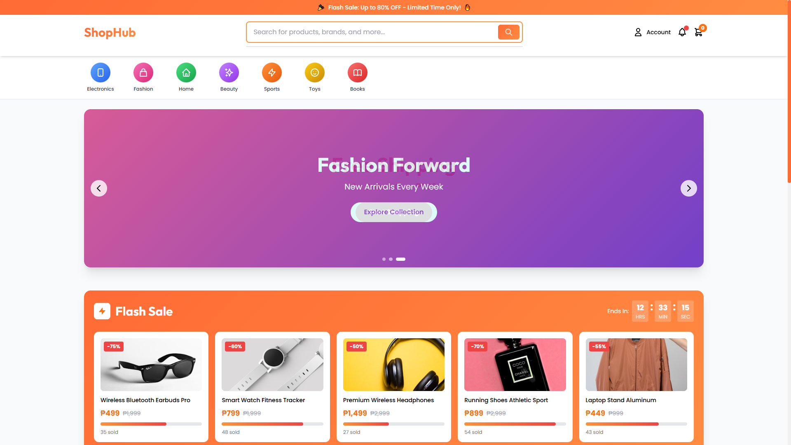

# (UNDER DEVELOPMENT)

# 🛒 ShopHub — E‑Commerce Platform

ShopHub is a modern **e‑commerce web application** built using a **Laravel REST API** and a **Vue.js Single Page Application (SPA)**. The project follows an industry‑standard architecture focused on scalability, clean separation of concerns, and long‑term maintainability.

This system is designed to handle real‑world e‑commerce needs such as product management, user authentication, order processing, and secure transactions.

---

## Screenshot

<p align="center">
  
</p>

---

## 🚀 Tech Stack

### Backend (API)

- **Laravel** — RESTful API backend
- **PHP**
- **MySQL** — relational database
- **Laravel Sanctum / JWT** — authentication
- **Eloquent ORM** — database interaction

### Frontend (SPA)

- **Vue.js 3**
- **Vite** — build tool
- **Pinia** — state management
- **Axios** — API communication
- **Vue Router** — client‑side routing

---

## 🧩 Architecture Overview

```
Frontend (Vue SPA)
   │
   │  Axios (HTTP Requests)
   ▼
Backend (Laravel REST API)
   │
   ▼
Database (MySQL)
```

- Frontend and backend are **fully decoupled**
- API‑driven communication
- Ready for future mobile app integration

---

## 🔐 Authentication

ShopHub uses **token‑based authentication**:

- Laravel Sanctum / JWT for secure login
- Protected API routes
- Role‑based access (Admin / Customer)

---

## ✨ Core Features

### 👤 User Features

- User registration & login
- Browse products by category
- Product search & filtering
- Shopping cart management
- Secure checkout process
- Order history tracking

### 🛠 Admin Features

- Product CRUD (Create, Read, Update, Delete)
- Category management
- Order management
- User management
- Inventory tracking

---

## 📂 Project Structure

### Backend (Laravel)

```
/app
/routes/api.php
/app/Http/Controllers
/app/Models
/database/migrations
```

### Frontend (Vue)

```
/src
  /components
  /views
  /router
  /stores
  /services
```

---

## ⚙️ Setup Instructions

### 1️⃣ Backend (Laravel API)

```bash
composer install
cp .env.example .env
php artisan key:generate
php artisan migrate
php artisan serve
```

### 2️⃣ Frontend (Vue SPA)

```bash
npm install
npm run dev
```

Make sure the API base URL is correctly set in Axios.

---

## 🌐 API Communication

- All data exchange is handled via REST endpoints
- JSON request/response format
- Centralized API service using Axios

---

## 📈 Scalability & Best Practices

- Separation of frontend and backend
- Reusable API for mobile apps
- Clean code and modular structure
- Secure authentication flow

---

## 🧪 Future Enhancements

- Payment gateway integration
- Product reviews & ratings
- Discount and voucher system
- Email notifications
- Mobile application support

---

## 👨‍💻 Author

**Wilfredo Domanico Jr.**

Full‑stack Web Developer

---

## 📄 License

This project is for educational and portfolio purposes.

---

> 💡 _ShopHub demonstrates a production‑ready Laravel + Vue architecture commonly used in real‑world enterprise applications._
